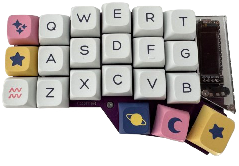
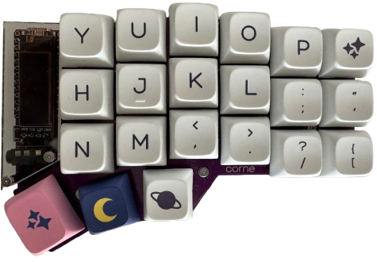
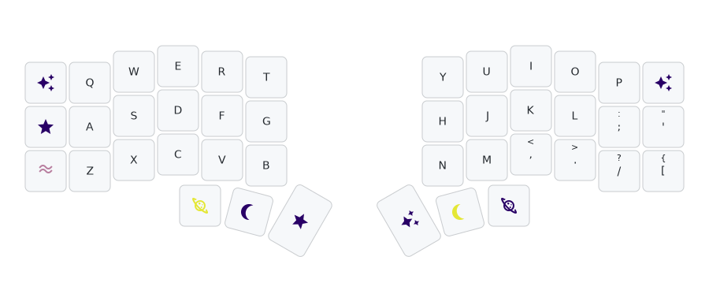
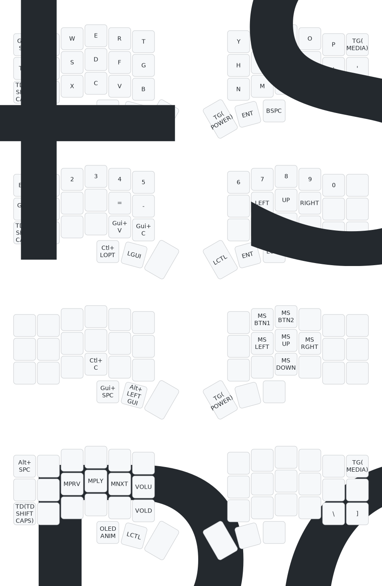

    

# Corne Cherry v3 Keymap
This repository stores my keymap file for my Corne Cherry v3 keyboard and builds my firmware.

    
    

## Design
- Keyboard Design
    - [Corne Keyboard](https://github.com/foostan/crkbd/tree/v3-final)
- Switches
    - Gateron KS-9 RGB Mechanical Red
- Keycaps
    - JOMKIZ Keycaps Constellation

## Visual Keymap

## Keymap Configuration

